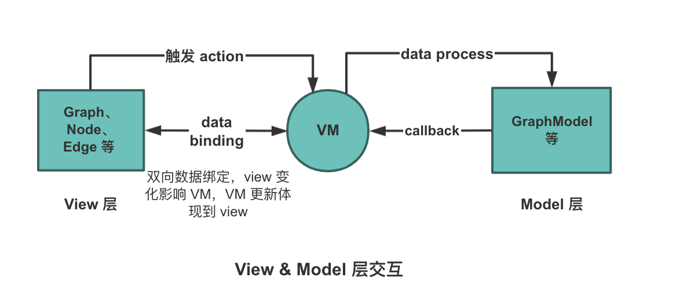

# LogicFlow

### 1. logicFlow是什么？

LogicFlow 是由滴滴体验平台技术研发的一款流程图编辑框架，提供了一系列流程图交互、编辑所必需的功能和简单灵活的节点自定义、插件等拓展机制，方便我们快速在业务系统内满足类流程图的需求。

### 2. LogicFlow图渲染为什么选择svg?

| 方案 | 优势 | 劣势 |
| :--- | :--- | :--- |
| 纯HTML | 入门简单，通过css绘制即可 | 不擅长“画线/曲线/箭头” |
| Canvas | 大规模绘制性能强； 基于像素，内存占用恒定 | 因为基于像素，所以没有元素Dom，实际点击的是画布。 不支持css修改样式 |
| Svg | 基于矢量，随意缩放旋转不失真； 基于Dom，支持css样式； | 海量元素时性能压力，但流程图中出现这种情况很少。 每帧大规模变形动画，可能不如 Canvas 顺滑。 |

结合 LogicFlow 的定位（流程图、节点/边可交互编辑、强调可扩展与自定义），SVG 通常是更均衡的选择：

*   **节点/边都是“对象”**：图编辑器最常见操作是选中、hover 高亮、拖拽、连线、修改样式。SVG 里这些对象天然存在（DOM 节点），事件绑定与状态切换非常直接。
*   **连线与箭头是 SVG 的强项**：路径（`<path>`）、贝塞尔曲线、虚线、marker 箭头、路径动画等，SVG 原生支持，且缩放不失真。
*   **缩放/平移/变换简单**：SVG 用transform 就能做整体变换，且图形仍保持矢量清晰。
*   **样式可配置与主题化友好**：通过 CSS/属性就能改边框、填充、选中态、hover 态；对“二次开发/自定义节点”更友好。

**为什么不全部用 SVG + foreignObject关于这个问题：**

1.  **兼容性与稳定性**
    *   foreignObject 在不同浏览器（尤其 Safari、移动端 WebView）支持不一致。常见问题包括字体渲染、CSS 解析、布局差异、滚动条表现不一致。
2.  **性能与重绘成本**
    *   SVG 本身适合绘制大量几何图形（节点、边、线条），轻量且易于变换。
    *   foreignObject 会把复杂的 HTML 布局引擎引入 SVG 渲染树，每次拖拽/缩放都会导致更重的重排与重绘。
    *   图编辑器交互频繁（拖拽、缩放、批量更新），性能敏感；因此让 HTML 尽量在 SVG 外层，是更合理的性能分工。
3.  **事件模型复杂且容易出问题**
    *   foreignObject 会形成“嵌套文档”，事件冒泡、pointer capture、滚轮/拖拽等行为容易与 SVG 外层冲突。
    *   一旦进入外层 SVG + 内层 HTML 的混合事件模型，很难做出统一、可预期的交互行为。

所以最终我们选择使用 **HTML + Svg** 来完成图的渲染，Svg 负责图形、线的部分，HTML 来实现文本、菜单、背景等图层。

### 3.MVVM + Virtual DOM

*   编辑器本身需要存储大量的状态数据（比如节点位置、选中状态等）；
*   为了让用户操作图时，编辑器的各个功能模块能及时做出正确反应，这些模块之间必须能实现“状态数据的传递和同步”（也就是状态通信）。

**View 层**：
Graph、Node、Edge 等
双向数据绑定，view 变化影响 VM，VM 更新体现到 view

**VM 层**：
触发 action -> data process -> callback -> VM

**Model 层**：
GraphModel 等

#### 3.1 Mobx是什么？

MobX 是一个基于「响应式编程」的 JavaScript 状态管理库，用来把 状态（数据） 和 视图（UI） 自动关联起来：你只要声明哪些数据是可观察的（observable），在 UI 渲染时读取它们；当这些数据变化时，MobX 会自动找出哪些 UI 依赖了这些数据，并只重渲染这些 UI（或触发相应计算）。

model 是状态源（observable），view 是观察者（observer），model 变了 view 自动更新。

| 概念 | 含义 | 作用 |
| :--- | :--- | :--- |
| observable | 可观察状态 | 标记需要监控的对象,成功后： 任何地方读取他，Mobx都能记录谁读了。 任何地方修改他，Mobx都能通知读过他的人更新。 |
| observer | 观察者 | observer(Component)会把组件变成观察者。 观察者会自动收集他读取哪些observable。 后续这些observable变化时，组件自动更新。 |
| action | 事件行为（修改状态入口） | 修改可观察状态的函数（推荐所有状态修改都放在 Action 中，便于追踪）； |
| computed | 缓存的计算结果 | 该值由observable推导出来，如果依赖没变则结果不变；如果依赖变了会自动更新并通知依赖该 computed的observer |
